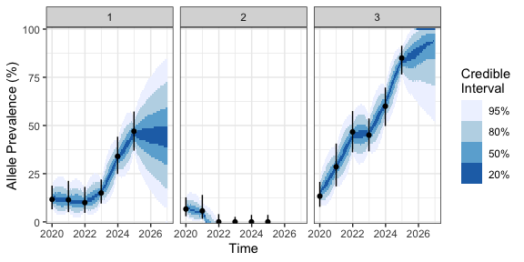
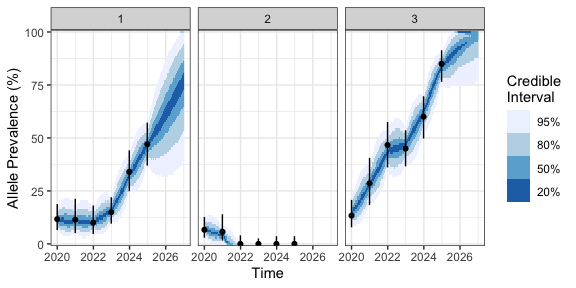

<!-- README.md is generated from README.Rmd. Please edit that file -->

<!-- badges: start -->

[](https://github.com/mrc-ide/genecastR/actions/workflows/checks_develop.yaml)
[](https://github.com/mrc-ide/genecastR/actions/workflows/checks_main.yaml)
<!-- badges: end -->

# genecastR

genecastR is an R package for modelling changes in allele prevalence
over time using genetic surveillance data. It estimates the strength of
selection acting on an allele while accounting for stochastic variation
due to genetic drift, and it provides tools to forecast future
prevalence and design efficient sampling strategies.

The package is designed for use in infectious disease
applications—particularly malaria—where the prevalence of resistance
alleles in *Plasmodium* parasites may change over time and space.
However, the approach is broadly applicable to other systems with
time-series allele frequency data.

## Installation

You can install genecastR from [GitHub](https://github.com/) with:

``` r
# install.packages("devtools")
devtools::install_github("mrc-ide/genecastR@v1.1.0")

library(genecastR)
```

Note the use of the @ symbol to specify a particular version when
installing. This is good practice to ensure your scripts remain stable
in the event of package updates.

## Data

The package includes an example dataset (`example_data`) with columns
for population (`pop`), time (`week`), number sampled (`n_samp`), and
number positive for the allele (`n_pos`).

``` r
head(example_data)
#>   pop week n_samp n_pos
#> 1   1   12     90    37
#> 2   1   24    100    65
#> 3   1   36     50    26
#> 4   1   48     60    43
#> 5   2   12     20     0
#> 6   2   24     50     2
```

You can visualize the prevalence data using `plot_prev()`:

``` r
library(ggplot2) # needed if we want to modify the plotting object

# plot data over a 2-year window
plot_prev(df_data = example_data) +
  xlim(c(0, 104))
```


This plot includes binomial confidence intervals on the observed
prevalence, which can also be extracted via `get_CIs()`. The dataset
includes multiple populations, though the model can also be applied to a
single population.

## Estimating selection coefficients via MCMC

The `run_mcmc()` function estimates the selection coefficient ($`s`$)
and diffusion parameter ($`\sigma`$) using Bayesian inference. The model
assumes a Wright-Fisher diffusion approximation with selection and
drift, and inference is performed via the
[drjacoby](https://mrc-ide.github.io/drjacoby/) MCMC framework.

``` r
# estimate parameters via MCMC
mcmc <- run_mcmc(df_data = example_data,
                 burnin = 1e2,
                 samples = 1e3)
#> MCMC chain 1
#> burn-in
#>   |                                                                              |=                                                                     |   2%  |                                                                              |==                                                                    |   3%  |                                                                              |===                                                                   |   4%  |                                                                              |====                                                                  |   5%  |                                                                              |====                                                                  |   6%  |                                                                              |=====                                                                 |   7%  |                                                                              |======                                                                |   8%  |                                                                              |======                                                                |   9%  |                                                                              |=======                                                               |  10%  |                                                                              |========                                                              |  11%  |                                                                              |========                                                              |  12%  |                                                                              |=========                                                             |  13%  |                                                                              |==========                                                            |  14%  |                                                                              |==========                                                            |  15%  |                                                                              |===========                                                           |  16%  |                                                                              |============                                                          |  17%  |                                                                              |=============                                                         |  18%  |                                                                              |=============                                                         |  19%  |                                                                              |==============                                                        |  20%  |                                                                              |===============                                                       |  21%  |                                                                              |===============                                                       |  22%  |                                                                              |================                                                      |  23%  |                                                                              |=================                                                     |  24%  |                                                                              |==================                                                    |  25%  |                                                                              |==================                                                    |  26%  |                                                                              |===================                                                   |  27%  |                                                                              |====================                                                  |  28%  |                                                                              |====================                                                  |  29%  |                                                                              |=====================                                                 |  30%  |                                                                              |======================                                                |  31%  |                                                                              |======================                                                |  32%  |                                                                              |=======================                                               |  33%  |                                                                              |========================                                              |  34%  |                                                                              |========================                                              |  35%  |                                                                              |=========================                                             |  36%  |                                                                              |==========================                                            |  37%  |                                                                              |===========================                                           |  38%  |                                                                              |===========================                                           |  39%  |                                                                              |============================                                          |  40%  |                                                                              |=============================                                         |  41%  |                                                                              |=============================                                         |  42%  |                                                                              |==============================                                        |  43%  |                                                                              |===============================                                       |  44%  |                                                                              |================================                                      |  45%  |                                                                              |================================                                      |  46%  |                                                                              |=================================                                     |  47%  |                                                                              |==================================                                    |  48%  |                                                                              |==================================                                    |  49%  |                                                                              |===================================                                   |  50%  |                                                                              |====================================                                  |  51%  |                                                                              |====================================                                  |  52%  |                                                                              |=====================================                                 |  53%  |                                                                              |======================================                                |  54%  |                                                                              |======================================                                |  55%  |                                                                              |=======================================                               |  56%  |                                                                              |========================================                              |  57%  |                                                                              |=========================================                             |  58%  |                                                                              |=========================================                             |  59%  |                                                                              |==========================================                            |  60%  |                                                                              |===========================================                           |  61%  |                                                                              |===========================================                           |  62%  |                                                                              |============================================                          |  63%  |                                                                              |=============================================                         |  64%  |                                                                              |==============================================                        |  65%  |                                                                              |==============================================                        |  66%  |                                                                              |===============================================                       |  67%  |                                                                              |================================================                      |  68%  |                                                                              |================================================                      |  69%  |                                                                              |=================================================                     |  70%  |                                                                              |==================================================                    |  71%  |                                                                              |==================================================                    |  72%  |                                                                              |===================================================                   |  73%  |                                                                              |====================================================                  |  74%  |                                                                              |====================================================                  |  75%  |                                                                              |=====================================================                 |  76%  |                                                                              |======================================================                |  77%  |                                                                              |=======================================================               |  78%  |                                                                              |=======================================================               |  79%  |                                                                              |========================================================              |  80%  |                                                                              |=========================================================             |  81%  |                                                                              |=========================================================             |  82%  |                                                                              |==========================================================            |  83%  |                                                                              |===========================================================           |  84%  |                                                                              |============================================================          |  85%  |                                                                              |============================================================          |  86%  |                                                                              |=============================================================         |  87%  |                                                                              |==============================================================        |  88%  |                                                                              |==============================================================        |  89%  |                                                                              |===============================================================       |  90%  |                                                                              |================================================================      |  91%  |                                                                              |================================================================      |  92%  |                                                                              |=================================================================     |  93%  |                                                                              |==================================================================    |  94%  |                                                                              |==================================================================    |  95%  |                                                                              |===================================================================   |  96%  |                                                                              |====================================================================  |  97%  |                                                                              |===================================================================== |  98%  |                                                                              |===================================================================== |  99%  |                                                                              |======================================================================| 100%
#> acceptance rate: 35.5%
#> sampling phase
#>   |                                                                              |                                                                      |   0%  |                                                                              |=                                                                     |   1%  |                                                                              |=                                                                     |   2%  |                                                                              |==                                                                    |   3%  |                                                                              |===                                                                   |   4%  |                                                                              |====                                                                  |   5%  |                                                                              |====                                                                  |   6%  |                                                                              |=====                                                                 |   7%  |                                                                              |======                                                                |   8%  |                                                                              |======                                                                |   9%  |                                                                              |=======                                                               |  10%  |                                                                              |========                                                              |  11%  |                                                                              |========                                                              |  12%  |                                                                              |=========                                                             |  13%  |                                                                              |==========                                                            |  14%  |                                                                              |===========                                                           |  15%  |                                                                              |===========                                                           |  16%  |                                                                              |============                                                          |  17%  |                                                                              |=============                                                         |  18%  |                                                                              |=============                                                         |  19%  |                                                                              |==============                                                        |  20%  |                                                                              |===============                                                       |  21%  |                                                                              |===============                                                       |  22%  |                                                                              |================                                                      |  23%  |                                                                              |=================                                                     |  24%  |                                                                              |==================                                                    |  25%  |                                                                              |==================                                                    |  26%  |                                                                              |===================                                                   |  27%  |                                                                              |====================                                                  |  28%  |                                                                              |====================                                                  |  29%  |                                                                              |=====================                                                 |  30%  |                                                                              |======================                                                |  31%  |                                                                              |======================                                                |  32%  |                                                                              |=======================                                               |  33%  |                                                                              |========================                                              |  34%  |                                                                              |=========================                                             |  35%  |                                                                              |=========================                                             |  36%  |                                                                              |==========================                                            |  37%  |                                                                              |===========================                                           |  38%  |                                                                              |===========================                                           |  39%  |                                                                              |============================                                          |  40%  |                                                                              |=============================                                         |  41%  |                                                                              |=============================                                         |  42%  |                                                                              |==============================                                        |  43%  |                                                                              |===============================                                       |  44%  |                                                                              |================================                                      |  45%  |                                                                              |================================                                      |  46%  |                                                                              |=================================                                     |  47%  |                                                                              |==================================                                    |  48%  |                                                                              |==================================                                    |  49%  |                                                                              |===================================                                   |  50%  |                                                                              |====================================                                  |  51%  |                                                                              |====================================                                  |  52%  |                                                                              |=====================================                                 |  53%  |                                                                              |======================================                                |  54%  |                                                                              |=======================================                               |  55%  |                                                                              |=======================================                               |  56%  |                                                                              |========================================                              |  57%  |                                                                              |=========================================                             |  58%  |                                                                              |=========================================                             |  59%  |                                                                              |==========================================                            |  60%  |                                                                              |===========================================                           |  61%  |                                                                              |===========================================                           |  62%  |                                                                              |============================================                          |  63%  |                                                                              |=============================================                         |  64%  |                                                                              |==============================================                        |  65%  |                                                                              |==============================================                        |  66%  |                                                                              |===============================================                       |  67%  |                                                                              |================================================                      |  68%  |                                                                              |================================================                      |  69%  |                                                                              |=================================================                     |  70%  |                                                                              |==================================================                    |  71%  |                                                                              |==================================================                    |  72%  |                                                                              |===================================================                   |  73%  |                                                                              |====================================================                  |  74%  |                                                                              |=====================================================                 |  75%  |                                                                              |=====================================================                 |  76%  |                                                                              |======================================================                |  77%  |                                                                              |=======================================================               |  78%  |                                                                              |=======================================================               |  79%  |                                                                              |========================================================              |  80%  |                                                                              |=========================================================             |  81%  |                                                                              |=========================================================             |  82%  |                                                                              |==========================================================            |  83%  |                                                                              |===========================================================           |  84%  |                                                                              |============================================================          |  85%  |                                                                              |============================================================          |  86%  |                                                                              |=============================================================         |  87%  |                                                                              |==============================================================        |  88%  |                                                                              |==============================================================        |  89%  |                                                                              |===============================================================       |  90%  |                                                                              |================================================================      |  91%  |                                                                              |================================================================      |  92%  |                                                                              |=================================================================     |  93%  |                                                                              |==================================================================    |  94%  |                                                                              |===================================================================   |  95%  |                                                                              |===================================================================   |  96%  |                                                                              |====================================================================  |  97%  |                                                                              |===================================================================== |  98%  |                                                                              |===================================================================== |  99%  |                                                                              |======================================================================| 100%
#> acceptance rate: 44.2%
#> chain completed in 5.751268 seconds
#> total MCMC run-time: 5.75 seconds
```

One important thing to note here is the use of priors. These are passed
in as functions, with the default being a log-normal prior on both $`s`$
and $`\sigma`$. See `?run_mcmc` for further details.

You can visualize posterior samples using:

``` r
library(patchwork) # for plotting side-by-side

# plot estimated posterior
p1 <- plot_mcmc_scatter(mcmc)
p2 <- plot_mcmc_density(mcmc)
p1 + p2
```


The model estimates a selection coefficient of around $`s=0.02`$. For a
final publication it would be worth running this MCMC for longer to give
a smoother result.

To extract 95% credible intervals on the selection coefficient:

``` r
estimate_Bayesian(mcmc)
#>          Q2.5        Q50      Q97.5
#> 1 0.006151841 0.02011935 0.04235823
```

When exploring posterior distributions, remember how your prior
influences your final results. In this case we used a log-normal prior,
meaning $`s`$ was forced to be positive. If we suspect there may be no
selective advantage to this allele, or even a selective disadvantage,
then we should use a different prior that allows for a broader range of
values.

## Forecasting allele prevalence

To estimate prevalence over time—including both interpolation and
forward projection—use `get_posterior_prev()` with fixed parameters or
sampled values from the posterior.

### Using fixed parameters

``` r
# produce posterior estimate of prevalence at all times
df_post <- get_posterior_prev(df_data = example_data,
                              s = 0,    # assume there is zero selection
                              sigma = 0.1,
                              week_max = 104)
#> Population 1:
#> Population 2:
#> Population 3:
```

``` r

# plot estimated prevalence
plot_prev(df_post = df_post, df_data = example_data)
```



The plot gives Bayesian credible intervals at each time point. Note that
these are *high density intervals* (HDI), rather than the more commonly
used equal-tailed intervals (ETI). This is important as the posterior
will often be *multi-modal*, meaning it features several distinct areas
of high probability, which are captured in the HDI. For example in the
plot above, in population 1 in week 75, we see the top 20% CrI includes
a prevalence of 100% (i.e. fixation of the allele) as well as a second
peak at around 80%. Both eventualities are plausible based on the model
prediction.

### Averaging over parameter uncertainty

A powerful approach is to feed a series of MCMC parameter draws into
`get_posterior_prev()`. The function then runs every value of $`s`$ and
$`\sigma`$ and takes the average of the output, effectively
marginalizing out our uncertainty in these parameters:

``` r
# take 100 draws from the sampling phase
mcmc_draws <- sample_mcmc(mcmc, n_draws = 100)

# produce posterior estimate of prevalence, averaging over parameter uncertainty
df_post <- get_posterior_prev(df_data = example_data,
                              s = mcmc_draws$s,
                              sigma = mcmc_draws$sigma,
                              week_max = 104)
#> Population 1:
#> Population 2:
#> Population 3:
```

``` r

# plot estimated prevalence
plot_prev(df_post = df_post, df_data = example_data)
```



Now we see a different result - in population 3 the allele is predicted
to continue increasing in prevalence over time. This is because our
posterior estimate of the selection coefficient tended to be around
0.02.

## Sample size calculation

genecastR can also guide sample size planning for future surveys or
experiments. It provides functions that use the posterior prevalence
distribution to evaluate how large a sample is needed for reliable
estimates or tests. We illustrate two common criteria below: one based
on achieving a desired margin of error for the prevalence estimate, and
another based on achieving sufficient power to detect if prevalence
crosses a threshold.

### Margin of error

This approach focuses on the precision of the prevalence estimate. The
margin of error (MOE) represents the half-width of the confidence
interval for the estimated prevalence (for example, an MOE of 0.1 means
the estimate should be within ±0.1, or ±10 percentage points, of the
true prevalence with a given confidence level).

- `get_MOE(pop, week, n_samp, df_post)` – Calculates the margin of error
  for the prevalence estimate at a specified time (`week`) for a given
  population (`pop`), if you sample `n_samp` individuals. It uses the
  posterior prevalence distribution (`df_post`) at that time to account
  for uncertainty in the true prevalence.
- `get_sample_size_MOE(pop, week, MOE, n_max, df_post)` – Determines the
  minimum sample size (up to a maximum `n_max`) required to achieve a
  desired margin of error (`MOE`) for a given population at that time
  point, based on the model’s posterior predictions.

For example, below we use these functions for populations 1 and 2 at
week 80. We first compute the margin of error with 100 samples, then
determine the sample size needed to reach an MOE of 0.1 (10%):

``` r
# sample size based on MOE
get_MOE(pop = 1, week = 80, n_samp = 100, df_post = df_post)
#> [1] 0.09284588
```

``` r
get_sample_size_MOE(pop = 1, week = 80, MOE = 0.1, n_max = 1e3, df_post = df_post)
#> sample_size 
#>          88
```

``` r

get_MOE(pop = 2, week = 80, n_samp = 100, df_post = df_post)
#> [1] 0.07623865
```

``` r
get_sample_size_MOE(pop = 2, week = 80, MOE = 0.1, n_max = 1e3, df_post = df_post)
#> sample_size 
#>          61
```

If we were to run a study in week 80, we would need an estimated 88
samples to obtain a 10% MOE in population 1, but only 61 samples for the
same MOE in population 2. This is because the prevalence in population 1
is predicted to be closer to 50%, which is where uncertainty is at its
largest. Note that these are *minimum* sample sizes for the number of
*malaria-positive* samples, and should be appropriately buffered to
account for drop-out and positive fraction.

### Threshold test

In the context of hypothesis testing, you might have a threshold
prevalence of interest (say 5%) that you want to be able to detect if
exceeded. genecastR includes functions to assess the power for detecting
whether the true prevalence is above such a threshold, and to determine
the sample size needed to achieve sufficient power.

- `get_power_ztest(pop, week, n_samp, prev_thresh, df_post)` – Estimates
  the statistical power to detect that the prevalence at a given time
  (`week`) is above a specified threshold (`prev_thresh`) in a
  population (`pop`), given a sample size of `n_samp`. It assumes a
  one-sample z-test and takes the predicted prevalence from the model
  output (`df_post`). The output is the probability (between 0 and 1)
  that a sample of size `n_samp` would correctly reject the null
  hypothesis (that prevalence ≤ prev_thresh) if the true prevalence is
  at the level predicted by the model.
- `get_sample_size_ztest(pop, week, prev_thresh, df_post)` – Determines
  the sample size needed to reliably detect a prevalence above
  `prev_thresh` for the given population and time. This function finds
  the smallest sample size such that the power of the z-test is high
  (80% by default) given a true prevalence taken from the model output.

In the example below, we calculate the power with a sample of 100 at
week 80 testing against a 5% prevalence threshold, and then compute the
recommended sample size for both population 1 and 2:

``` r
# sample size based on z-test
get_power_ztest(pop = 1, week = 80, n_samp = 100, prev_thresh = 0.05, df_post = df_post)
#> # A tibble: 1 × 1
#>   power
#>   <dbl>
#> 1 0.996
```

``` r
get_sample_size_ztest(pop = 1, week = 80, prev_thresh = 0.05, df_post = df_post)
#> sample_size 
#>          10
```

``` r

get_power_ztest(pop = 2, week = 80, n_samp = 100, prev_thresh = 0.05, df_post = df_post)
#> # A tibble: 1 × 1
#>   power
#>   <dbl>
#> 1 0.327
```

``` r
get_sample_size_ztest(pop = 2, week = 80, prev_thresh = 0.05, df_post = df_post)
#> Could not find a sample size that achieves desired power within the user-defined range (n_min = 10:n_max = 1000)
#> NULL
```

In population 1 we need just 10 samples to achieve 80% power. This is
because the model is extremely confident that prevalence is high,
meaning we are likely to yield data that gives a significant result.
Note that 10 samples is an enforced minimum that this function can
return, and in reality it may not make logistical sense to collect such
a small number of samples from one location. Therefore this statistical
recommendation should be considered alongside other decision parameters.

In population 2 we only achieve 32.7% power with 100 samples, and the
second function was unable to find a sample size that achieves 80% power
within the maximum allowed (`n_max=1000`) samples. This is because the
model gives a large weight to the possibility that prevalence is *below*
the 5% threshold, in which case power under our one-sided test would be
zero.
